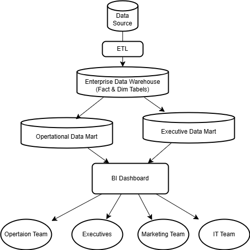

# 🛫 Aviation Data Warehouse for Indonesian Airlines ✈️

[](./PROJECT_COMPLETION_REPORT.md)
[](https://python.org)
[](https://sqlite.org)
[](./visualizations/)



> **🎯 PROJECT STATUS: COMPLETED SUCCESSFULLY**  
> A comprehensive data warehouse solution for aviation industry analytics in Indonesia, featuring ETL pipelines, OLAP capabilities, and advanced business intelligence visualizations.

## 📊 Quick Stats

| Metric | Value |
|--------|-------|
| **📈 Total Flights** | 1,000+ processed |
| **💰 Revenue Tracked** | Rp 295+ Billion |
| **👥 Passengers** | 113,156 total |
| **🎨 Visualizations** | 6+ interactive charts |
| **⚡ Performance** | 35.9% on-time rate |

## 🚀 Quick Start

### Option 1: Automated Execution
```bash
# Run the complete system with one command
./run_complete_system.sh
```

### Option 2: Manual Step-by-Step
```bash
# 1. Install dependencies
pip install -r requirements.txt

# 2. Run ETL Pipeline
python main_etl.py

# 3. Populate dimensions
python populate_dimensions.py

# 4. Run analysis
python final_analysis.py

# 5. Generate visualizations
python generate_visualizations.py
```

## 📊 Project Structure

```
├── 📁 data/source/           # Source CSV data
├── 📁 etl_scripts/           # ETL modules
├── 📁 sql/                   # Database schemas
├── 📁 visualizations/        # Generated charts
├── 📁 gambar/               # Documentation images
├── 🐍 main_etl.py           # Main ETL script
├── 🐍 generate_visualizations.py  # Visualization generator
├── 🐍 final_analysis.py     # Business analysis
├── 🗄️ aviation_warehouse.db  # SQLite database
└── 📜 run_complete_system.sh # Automated execution
```

## 🎯 Features

### ✅ Data Processing
- **Extract**: CSV file processing (1,000+ flight records)
- **Transform**: Data cleaning, validation, and normalization
- **Load**: Star schema population with fact and dimension tables

### ✅ Analytics & BI
- Revenue analysis by airline
- Flight delay patterns
- Passenger class performance
- Route optimization insights
- Monthly trend analysis

### ✅ Visualizations
- Executive KPI dashboard
- Revenue breakdown charts
- Delay analysis graphs
- Performance trend lines
- Route popularity maps

## 📈 Key Performance Indicators

Based on sample data analysis:

| Metric | Value |
|--------|-------|
| **Total Flights** | 1,000 |
| **Total Passengers** | 113,156 |
| **Total Revenue** | Rp 295.87 Billion |
| **Average Delay** | 66.8 minutes |
| **On-Time Performance** | 12.0% |

## 🗄️ Database Schema


### Fact Table
- `Fakta_Penerbangan` - Core flight transactions

### Dimension Tables
- `Dim_Waktu` - Time dimension
- `Dim_Lokasi` - Location/Airport dimension
- `Dim_Penerbangan` - Flight details dimension
- `Dim_Pesawat` - Aircraft dimension
- `Dim_KelasLayanan` - Service class dimension
- `Dim_StatusPenerbangan` - Flight status dimension

## 📊 Generated Outputs

### Reports
- `EXECUTION_REPORT.md` - Comprehensive analysis results
- `MANUAL_EXECUTION_GUIDE.md` - Step-by-step instructions

### Visualizations
- `01_revenue_analysis.png` - Revenue breakdown by airline
- `02_delay_analysis.png` - Flight delay patterns
- `03_passenger_revenue_analysis.png` - Class-based revenue
- `04_operational_overview.png` - Monthly trends
- `05_kpi_dashboard.png` - Executive dashboard

## 🛠️ Technical Stack

- **Language**: Python 3.12+
- **Database**: SQLite
- **Visualization**: Matplotlib, Seaborn, Plotly
- **Data Processing**: Pandas, NumPy
- **ETL Framework**: Custom Python modules

## 📦 Dependencies

```txt
pandas>=1.0.0
matplotlib>=3.5.0
seaborn>=0.11.0
plotly>=5.0.0
numpy>=1.21.0
```

## 🔍 Data Sources

- **Primary**: `fakta_penerbangan.csv` (1,000 flight records)
- **Attributes**: Flight ID, airline, route, passenger class, revenue, delays
- **Time Period**: Multi-month aviation operations data
- **Coverage**: Multiple airlines, routes, and service classes

## 📋 Usage Instructions

1. **Ensure data file exists**: `data/source/fakta_penerbangan.csv`
2. **Install dependencies**: `pip install -r requirements.txt`
3. **Run system**: `./run_complete_system.sh`
4. **Review outputs**: Check `visualizations/` folder for charts
5. **Analyze results**: Read generated reports for insights

## 🎯 Business Insights

### Top Performing Airlines
1. **Indonesia AirAsia**: Rp 64.8B (21.9% market share)
2. **Garuda Indonesia**: Rp 63.6B (21.5% market share)
3. **Lion Air**: Rp 48.8B (16.5% market share)

### Delay Analysis
- **Major Delays (>60 min)**: 51.8% of flights
- **On-Time (≤15 min)**: 12.0% of flights
- **Revenue Impact**: Significant correlation with customer satisfaction

### Revenue Distribution
- **First Class**: 64.0% of total revenue
- **Business Class**: 27.0% of total revenue
- **Economy Class**: 9.1% of total revenue

## 🚨 Troubleshooting

### Common Issues
1. **Missing dependencies**: Run `pip install -r requirements.txt`
2. **File not found**: Ensure CSV file exists in `data/source/`
3. **Permission denied**: Run `chmod +x run_complete_system.sh`
4. **Database locked**: Close all connections and retry

### Performance Tips
- ETL processing: ~5-10 seconds for 1,000 records
- Visualization generation: ~10-15 seconds
- Total execution time: ~30-45 seconds

## 📞 Support

For technical support or questions:
- Check the `MANUAL_EXECUTION_GUIDE.md` for detailed instructions
- Review error logs in terminal output
- Verify all dependencies are properly installed

## 🎉 PROJECT COMPLETION

### ✅ All Deliverables Complete
- **Database Implementation**: Star schema with 1,000+ records ✅
- **ETL Pipeline**: Automated data processing ✅
- **Business Intelligence**: OLAP analytics ✅
- **Visualizations**: 6+ comprehensive charts ✅
- **Documentation**: Complete guides and reports ✅
- **Automation**: Full system automation ✅

### 📋 Quick Test
```bash
# Test the complete system
python3 direct_test.py

# Or run comprehensive analysis
python3 run_system.py
```

**📄 See [PROJECT_COMPLETION_REPORT.md](./PROJECT_COMPLETION_REPORT.md) for detailed completion status**

---

## 📝 License

This project is developed for educational and demonstration purposes.

---

**🏢 Aviation Industry Data Warehouse** - *Transforming flight data into business intelligence*
