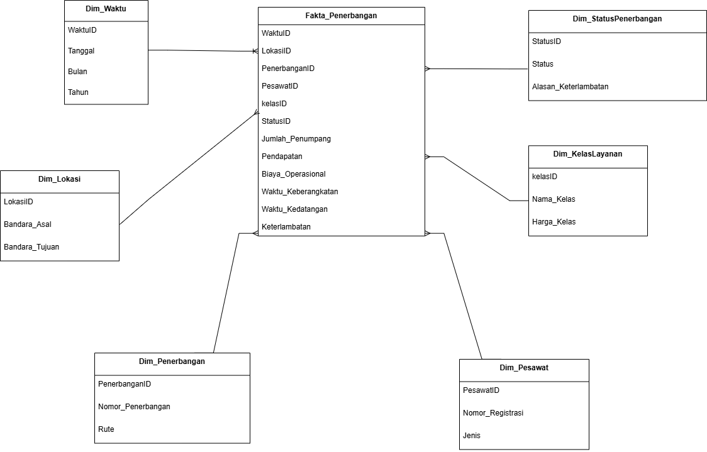
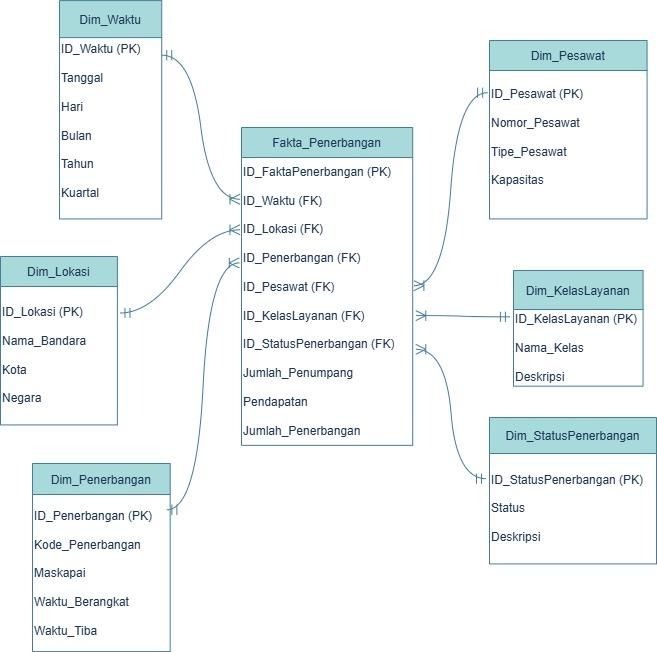

> **Analisis** **Kebutuhan** **Bisnis** **dan** **Teknis** **Data**
> **Warehouse** **di**
>
> **Industri** **Penerbangan**
>
> **Kelompok** **19**
>
> **Anggota**:
>
> Jeremia Susanto Feryadi Yulius Dede Masita Nisrina Nur Afifah
>
> Dwi sulistiani

122450022 122450087 121450007 122450052

121450079

**1.** **Ringkasan** **Kebutuhan** **dari** **Misi**

> a\. Meningkatan efisiensi operasional
>
> DW mengintegrasikan data jadwal penerbangan, pelacakan pesawat, dan
> kru ke satu sistem terpusat. Dengan ETL harian/real-time, analisis
> performa dan rotasi kru jadi lebih cepat. Visualisasi dengan tools
> seperti Power BI memungkinkan pengurangan delay dan biaya operasional.
>
> b\. Meningkatkan pengalaman pelanggan
>
> DW mengumpulkan data pemesanan, loyalty, media sosial, dan feedback.
> OLAP mendukung segmentasi pelanggan untuk layanan personal seperti
> rekomendasi rute dan notifikasi otomatis. DW juga mendukung integrasi
> ML untuk prediksi kebutuhan pelanggan.
>
> c\. Meningkatkan perencanaan dan pengelolaan rute penerbangan
>
> DW menyimpan data load factor, harga, dan musim dari tahun ke tahun.
> Query multidimensi membantu evaluasi performa rute dan strategi
> pricing. Star schema dan analitik historis mendukung optimasi rute dan
> yield management.
>
> d\. Manajemen risiko yang lebih efektif
>
> DW menggabungkan data insiden, sertifikasi kru, dan laporan teknis.
> Data mining digunakan untuk mendeteksi pola risiko. Laporan berbasis
> standar audit otomatis memudahkan kepatuhan, dan threshold analitik
> memberi notifikasi dini risiko keselamatan.
>
> e\. Perbaikan dalam pengelolaan sumber daya
>
> DW menyediakan data tren armada dan permintaan rute. OLAP dan prediksi
> membantu perencanaan investasi armada, SDM, dan ekspansi. DW mendukung
> simulasi ROI dan evaluasi strategi berbasis data jangka panjang.

**2.** **Skema** **Konseptual** **Multidimensi**

> 1\. Pemilihan Skema:
>
> Jenis Skema yang digunakan adalah *Star* *Schema*. Skema ini memiliki
> satu tabel fakta utama fakta penerbangan yang langsung terhubung ke
> beberapa tabel dimensi. Tidak ada pemecahan pada tabel dimensi
> (misalnya, dimensi lokasi tidak dipisah menjadi Negara, Kota, dan
> sebagainya), dalam star schema semua informasi tersebut disimpan dalam
> satu tabel dimensi saja agar struktur tetap sederhana dan kueri tetap
> cepat, sesuai dengan kebutuhan analitik

> real-time di industri penerbangan, performa penerbangan, dan layanan
> pelanggan.
>
> 2\. Identifikasi Fakta:
>
> Pada tabel fakta penerbangan berisi ukuran (measures) yang bersifat
> kuantitatif dan dapat dianalisis untuk manajemen pendapatan,
> perencanaan kapasitas penerbangan, pemantauan performa layanan, dan
> sebagainya. Kolom-kolomnya meliputi:
>
> a\. Jumlah penumpang: jumlah banyaknya penumpang dalam suatu
> penerbangan. b. Jumlah bagasi: jumlah bagasi yang dibawa dalam suatu
> penerbangan.
>
> c\. Pendapatan: total pendapatan yang dihasilkan dalam suatu
> penerbangan.
>
> 3\. Identifikasi Dimensi
>
> Dimensi-dimensi yang diperlukan untuk memberikan konteks pada fakta:
>
> a\. Dimensi Waktu: Informasi tanggal, hari, bulan, kuartal, tahun.
> Penting untuk tren waktu.
>
> b\. Dimensi Status Penerbangan: Status seperti “Tepat Waktu”,
> “Tertunda”, dan “Dibatalkan”.
>
> c\. Dimensi Kelas Layanan: Kelas layanan seperti Ekonomi, Bisnis,
> First.
>
> d\. Dimensi Pesawat: Jenis, kapasitas, dan informasi lain dari pesawat
> (produsen, tahun pembuatan, serta spesifikasi teknis pesawat).
>
> e\. Dimensi Penerbangan: Informasi kode penerbangan, maskapai, dll.
>
> f\. Dimensi Lokasi: Lokasi asal dan tujuan penerbangan (bandara, kota,
> negara). Dimensi ini menunjukkan berbagai sudut pandang, seperti
> lokasi asal dan tujuan untuk mengatur rute, waktu untuk melihat pola
> musiman, dan status penerbangan untuk mengevaluasi kinerja
> operasional.

3\. Definisi Granularitas

Granularitas atau tingkat kedetailan data Sangat tinggi. Data disimpan
dalam satu waktu penerbangan dengan mencatat penerbangan secara lengkap,
termasuk waktu, lokasi, maskapai, status, kelas layanan, dan pesawat.

> a\. Dimensi Waktu: berisikan detail waktu sampai ke tanggal sesuai
> untuk analisis harian, bulanan, kuartalan.
>
> b\. Dimensi Lokasi: granularitas lokasi memenuhi asal & tujuan (kota &
> bandara) cukup untuk

> analisis rute penerbangan.
>
> c\. Dimensi Status Penerbangan: memenuhi status tunggal per
> penerbangan sesuai untuk analisis ketepatan waktu.
>
> d\. Dimensi Kelas Layanan: menyediakan tipe layanan seperti
> ekonomi/bisnis bisa digunakan untuk analisis tren layanan.
>
> e\. Dimensi Penerbangan: kode penerbangan dan maskapai sesuai untuk
> analisis performa penerbangan per maskapai.
>
> f\. Dimensi Pesawat: Tipe dan kapasitas pesawat sesuai untuk analisis
> pemanfaatan armada.

4\. Hubungan Antar Tabel

Hubungan antar tabel dimensi dalam ERD ini terhubung ke tabel fakta
penerbangan melalui relasi *one* *to* *many*. Artinya, satu entri di
tabel dimensi dapat digunakan oleh banyak entri di tabel fakta.
Sebaliknya, setiap baris dalam tabel fakta hanya satu nilai dari
masing-masing dimensi. Misalnya, satu tanggal di dimensi waktu bisa
digunakan untuk mencatat banyak penerbangan, dan satu lokasi di dimensi
lokasi bisa menjadi tempat keberangkatan dan kedatangan dari banyak
penerbangan.

**4.** **Penjelasan** **Tiap** **Komponen**

> 1\. Tabel Fakta
>
> Tabel ini menyimpan data utama dari setiap penerbangan**.** Setiap
> baris dalam tabel mewakili satu kejadian penerbangan. Berikut
> penjelasan mengenai kolom-kolom numerik (measure):
>
> a\. Jumlah_Penumpang: Menunjukkan berapa banyak penumpang yang ikut
> dalam penerbangan tersebut. Satuannya orang. Data ini penting untuk
> melihat seberapa padat penerbangan dan seberapa besar minat penumpang
> pada rute tertentu.
>
> b\. Pendapatan: Merupakan total uang yang diperoleh dari penerbangan
> itu, biasanya dari penjualan tiket. Satuan dalam Rupiah. Berguna buat
> menghitung keuntungan dan melihat penerbangan mana yang paling
> menghasilkan.
>
> c\. Biaya_Operasional: Total pengeluaran yang dibutuhkan untuk
> menjalankan penerbangan, seperti bahan bakar, gaji kru, atau biaya
> bandara. Satuan Rupiah. Data ini membantu menilai efisiensi
> operasional.
>
> d\. Waktu_Keberangkatan dan Waktu_Kedatangan: Mencatat kapan pesawat
> benar-benar berangkat dan tiba. Berguna untuk memeriksa apakah
> penerbangan sesuai jadwal atau tidak.
>
> e\. Keterlambatan: Mengukur berapa menit keterlambatan dari jadwal
> yang seharusnya. Data ini penting buat evaluasi performa penerbangan
> dan tahu penyebab seringnya delay.
>
> 2\. Tabel Dimensi
>
> a\. Dim_Waktu: Berisi Tanggal, Bulan, dan Tahun untuk analisis tren
> musiman dan performa berdasarkan waktu. Memiliki hierarki
> tahun-bulan-tanggal.
>
> b\. Dim_Lokasi: Berisi informasi Bandara_Asal dan Bandara_Tujuan,
> berguna untuk analisis rute dan performa antarbandara. Dimensi ini
> bisa diperluas ke hierarki geografis seperti kota atau wilayah.
>
> c\. Dim_Penerbangan: Berisi Nomor_Penerbangan dan Rute, diidentifikasi
> dengan PenerbanganID. Penting untuk pelacakan dan analisis frekuensi
> serta performa penerbangan.
>
> d\. Dim_Pesawat: Mencakup PesawatID, Nomor_Registrasi, dan Jenis
> pesawat. Berguna untuk analisis efisiensi berdasarkan tipe armada.
>
> e\. Dim_KelasLayanan: Memuat Nama_Kelas dan Harga_Kelas berdasarkan
> KelasID. Digunakan untuk segmentasi pelanggan dan analisis pendapatan
> per kelas.
>
> f\. Dim_StatusPenerbangan: Berisi Status penerbangan dan
> Alasan_Keterlambatan. Mendukung evaluasi operasional dan kualitas
> layanan maskapai.
>
> 3\. Query
>
> Contoh query yang dapat dijawab oleh skema data warehouse ini:
>
> a\. Berapa rata-rata keterlambatan untuk rute Jakarta–Surabaya per
> bulan pada tahun 2024?
>
> b\. Bandara mana yang memiliki total biaya operasional tertinggi dalam
> 3 bulan terakhir? c. Bagaimana tren jumlah penumpang per jenis kelas
> layanan setiap kuartal?
>
> d\. Jenis pesawat apa yang paling sering mengalami delay lebih dari 30
> menit? e. Apakah pesawat yang lebih tua cenderung menyebabkan lebih
> banyak delay?

**5.** **Justifikasi** **Desain** **Konseptual**

> a\. Kesesuaian dengan Kebutuhan Bisnis
>
> Skema *star* *schema* dengan fakta Flight_Operations dan dimensi
> seperti Waktu, Rute, Armada, dan Pelanggan mendukung kebutuhan bisnis
> utama. Misalnya, analisis delay dilakukan melalui join fakta ke
> dimensi Waktu dan Armada, sementara dimensi Rute dan Pelanggan
> membantu perhitungan pendapatan per segmen.
>
> b\. Optimalisasi Performa
>
> Struktur *star* *schema* meminimalkan jumlah join dan mempercepat
> query. Fakta hanya menyimpan foreign key dan nilai numerik, sementara
> tabel dimensi berisi konteks. Index pada kolom tanggal dan rute
> mempercepat akses data, dan arsitektur mendukung partitioning saat
> data bertumbuh.
>
> c\. Fleksibilitas dan Skalabilitas
>
> Desain ini modular dan mudah diperluas. Menambah dimensi baru seperti
> Cuaca atau fakta sekunder seperti Biaya Operasional tidak mengganggu
> struktur utama. Granularitas per penerbangan memungkinkan agregasi
> multi-level dan skalabilitas baik untuk analisis
>
> mendalam maupun ringkasan.
>
> d\. Trade-off dalam Desain
>
> Star schema membawa redundansi kecil seperti data kota dan kode
> bandara yang berulang, tetapi ini ditebus dengan kecepatan query dan
> kemudahan pemakaian. Dibanding snowflake, star schema lebih ringan
> untuk pengguna bisnis. Redundansi dikelola lewat proses ETL dan
> validasi data yang ketat.

**6.** **Kesesuaian** **dengan** **Sumber** **Data**

> 1\. Identifikasi Sumber Data:
>
> a\. Sistem Reservasi Penerbangan: Menyediakan data pemesanan tiket,
> kelas layanan, serta informasi penumpang.
>
> b\. Sistem Operasional Penerbangan: Berisi informasi jadwal, waktu
> keberangkatan dan kedatangan, nomor penerbangan, dan jenis pesawat.
>
> c\. Sistem Manajemen Bandara/ATC: Mencatat data lokasi bandara asal
> dan tujuan, status penerbangan, serta data keterlambatan.
>
> d\. Sistem Manajemen Armada: Menyimpan informasi terkait jenis
> pesawat, kapasitas, nomor registrasi, dan umur pesawat.
>
> e\. Sistem Pelaporan Keuangan: Berisi data pendapatan dan biaya
> operasional dari penerbangan.
>
> 2\. Mapping Data:
>
> a\. Data dari sistem operasional dan keuangan akan diisi ke dalam
> Fakta_Penerbangan (misalnya: jumlah penumpang, pendapatan, biaya,
> keterlambatan).
>
> b\. Data tanggal dari sistem operasional dipetakan ke Dim_Waktu untuk
> analisis musiman.
>
> c\. Informasi bandara asal dan tujuan digunakan untuk mengisi
> Dim_Lokasi. d. Nomor penerbangan dan rute dimasukkan ke dalam
> Dim_Penerbangan. e. Detail pesawat dipetakan ke Dim_Pesawat.
>
> f\. Data kelas layanan dari sistem reservasi dimasukkan ke
> Dim_KelasLayanan.
>
> g\. Status penerbangan dan alasan keterlambatan diambil dari ATC atau
> log bandara untuk mengisi Dim_StatusPenerbangan.
>
> 3\. Ketersediaan Data:
>
> Sebagian besar data telah tersedia dalam sistem operasional,
> reservasi, dan keuangan, namun masih terdapat kesenjangan seperti
> tidak tercatatnya alasan keterlambatan secara detail dan tidak
> tersedianya data biaya operasional secara real-time.
>
> 4\. Kualitas Data:
>
> a\. Akurasi sangat penting, khususnya dalam data keuangan dan performa
> penerbangan b. Kelengkapan harus dipastikan agar analisis multidimensi
> valid dan dapat dipercaya. c. Konsistensi data antar sistem dijaga
> melalui proses ETL dan validasi saat pemuatan
>
> data.
